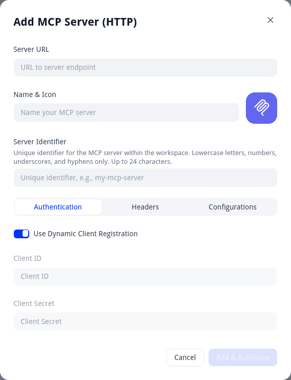
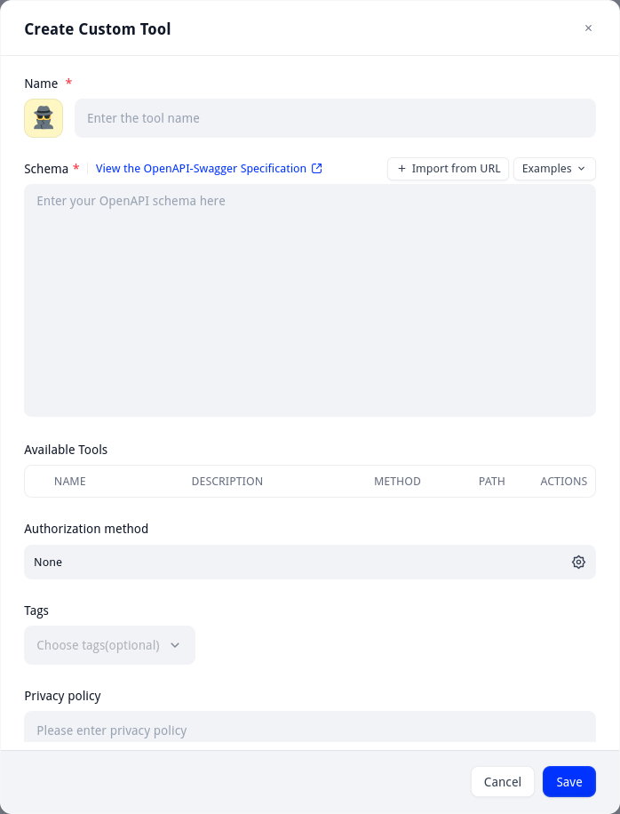
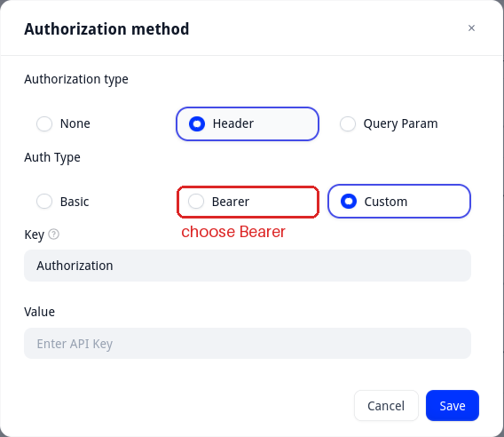
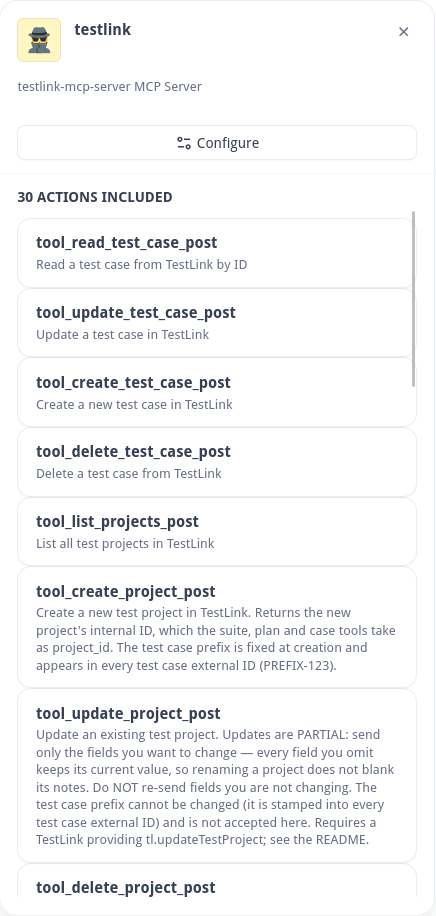
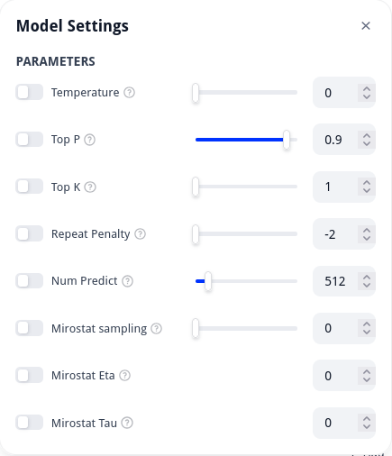
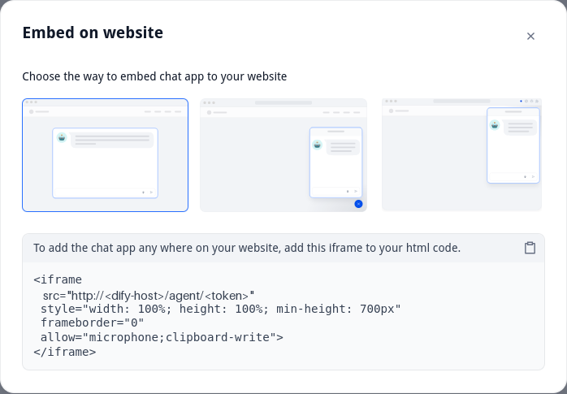

# Dify how-to: a TestLink agent beside TestLink

This guide connects a Dify agent to TestLink through the mcpo proxy in [../mcpo/](../mcpo/), and opens the agent's chat in Chrome's side panel, beside TestLink. Run the proxy first.

```
Chrome side panel ──▶ Dify agent ──REST──▶ mcpo :8000 ──stdio──▶ testlink-mcp ──XML-RPC──▶ TestLink
                                   Bearer MCPO_API_KEY
```

| Step | Where | Status |
|---|---|---|
| 1. Add mcpo as a custom tool | Dify web GUI | Done: 30 actions listed |
| 2. Let Dify reach mcpo | Dify host `.env` | Done: the agent listed projects |
| 3. Give the model enough context | Ollama | Not verified yet |
| 4. Set up the agent | Dify web GUI | Not verified yet |
| 5. Open the chat beside TestLink | Chrome | Done: the chat opens in the side panel |

## 1. Add mcpo as a custom tool

mcpo serves REST with an OpenAPI schema; it is not an MCP server. Add it under **Integrations → Swagger API as Tool**, not under **MCP**.



mcpo's schema gives the server as the relative path `/testlink`, and Dify needs a full URL. Save a copy with the full URL on the mcpo host. Git ignores `testlink-openapi.json`, because it holds your host address:

```bash
curl -s localhost:8000/testlink/openapi.json | python3 -c "import json,sys; d=json.load(sys.stdin); \
  d['servers']=[{'url':'http://<mcpo-host>:8000/testlink'}]; print(json.dumps(d, indent=2))" > testlink-openapi.json
```

Open **Create Custom Tool**. Name it `testlink`, and paste `testlink-openapi.json` into **Schema**. Do not use **Import from URL**; it brings back the relative server URL. **Available Tools** fills with 30 tools.



Click the gear by **Authorization method**. Choose **Header** and **Bearer**, keep the key `Authorization`, and paste `MCPO_API_KEY` from `mcpo/.env` as the value, without a `Bearer ` prefix.



Save. The tool lists 30 actions, named from mcpo's operation IDs, such as `tool_read_test_case_post`.



Repeat this step when testlink-mcp adds or changes tools.

## 2. Let Dify reach mcpo

Dify sends tool calls through an SSRF proxy that blocks private addresses. Agents use their own proxy, `agent_ssrf_proxy`; a blocked call reports that the mcpo host is outside the allowed range. The web GUI has no setting for this.

Both proxies read `SSRF_PROXY_ALLOW_PRIVATE_IPS` in `docker/.env` on the Dify host. It lists the private addresses that tools may call, and it is empty by default. Set it to the mcpo host:

```
SSRF_PROXY_ALLOW_PRIVATE_IPS=<mcpo-host>/32
```

If it already lists other addresses, add the mcpo host after a comma. Dify's own container subnets do not belong here. Keep the entry at `/32`; a wider range lets any tool or prompt reach every host in it.

Recreate both proxies so they read the new value. `docker compose restart` is not enough: it restarts the same containers, which keep the environment they were created with.

```bash
docker compose up -d ssrf_proxy agent_ssrf_proxy
docker compose exec agent_ssrf_proxy cat /etc/squid/dify_allow_private.conf
```

`docker compose ps` shows the proxies created seconds ago; after a restart, they still show the old creation time. The file lists `<mcpo-host>/32` in an `acl dify_allowed_private_networks dst` rule.

| Catch | Detail |
|---|---|
| Agents use a separate proxy | Before Dify 1.17.1, the agent proxy ignored the allowlist ([#41870](https://github.com/langgenius/dify/pull/41870)). Upgrade first if older |
| `envs/infrastructure/ssrf-proxy.env` is ignored | The `ssrf_proxy` service does not load it ([#40415](https://github.com/langgenius/dify/issues/40415)). Use the root `docker/.env` |
| The agent's sandbox has no network | `curl` from the agent's sandbox fails by design. Only tool calls, through `agent_ssrf_proxy`, reach mcpo |

When it works, the mcpo logs show `POST /testlink/...` from the Dify host.

## 3. Give the model enough context

Ollama loads a model with a 4096-token context by default. An agent with all 30 tools sent 6251 tokens, and Ollama refused it:

```
error: request (6251 tokens) exceeds the available context size (4096 tokens)
```

Dify's **Model Settings** has no context-size parameter, so create a model variant in Ollama. It shares the original weights:

```bash
docker exec ollama sh -c 'printf "FROM ornith-1.5:9b\nPARAMETER num_ctx 16384\n" > /tmp/Modelfile \
  && ollama create ornith-1.5:9b-16k -f /tmp/Modelfile'
```

Add `ornith-1.5:9b-16k` under **Integrations → Model Provider → Ollama**, and pick it as the agent's model.

## 4. Set up the agent

Under **Tools**, add `testlink`, then turn off every action except these. Fewer tools mean a shorter prompt, and no delete tool means the agent cannot delete anything.

| Use | Actions |
|---|---|
| Read | `list_projects`, `list_test_suites`, `list_test_cases_in_suite`, `read_test_case`, `get_requirement` |
| Write | `create_test_case`, `update_test_case` |

Dify's chat has no Apply button, so add a rule to the agent's prompt:

```
Before calling create_test_case or update_test_case, show the change and ask
the user to reply "apply". Call the tool only after the user replies "apply".
```

The rule is a prompt, not a lock; the model can still skip it.

In **Model Settings**, every switch is off by default, so Ollama uses `temp 0.8, top_k 40, top_p 0.9`.



`ornith-1.5:9b` is based on Qwen 3.5 with thinking on, so start from Qwen's thinking-mode values:

| Parameter | Switch | Value | Why |
|---|---|---|---|
| Temperature | on | 0.6 | Steadier tool arguments; 0 can make thinking models loop |
| Top P | on | 0.95 | Qwen's thinking-mode value |
| Top K | on | 20 | Qwen's thinking-mode value |
| Repeat Penalty | off | | The shown value, -2, is invalid |
| Num Predict | off | | 512 cuts answers off during thinking |
| Mirostat | off | | Not needed |

Lower Temperature to 0.3 if tool arguments come out wrong.

## 5. Open the chat beside TestLink

In the agent, open **Access Point** and copy the **Web App → Access URL**. Then install [Chatbot Side Panel for Dify](https://github.com/dogkeeper886/chatbot-chrome-extension), our fork of the Dify Chatbot extension: load it unpacked, click its icon, and save that URL on its settings page. On the TestLink page, click the icon; the agent's chat opens in Chrome's side panel.

**Embed Into Site** offers three other ways, and none fits. The iframe and the chat bubble script need a change to TestLink's pages. The original Dify Chatbot Chrome extension is archived and injects its chat into the page, where it often fails to appear; our fork replaces that with the side panel.



Ask with a test case ID, such as "review TLMCP-12". The mcpo logs show a `read_test_case` call. The Access URL is a public share link: anyone who has it can use the agent, so share it only on a trusted network.
