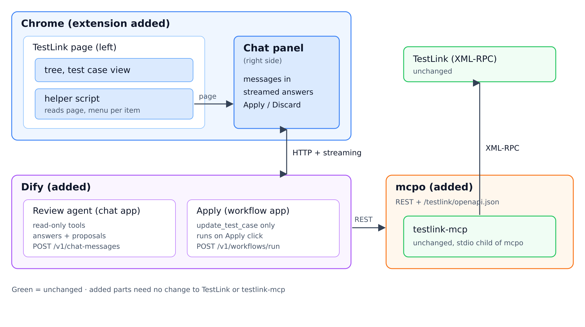
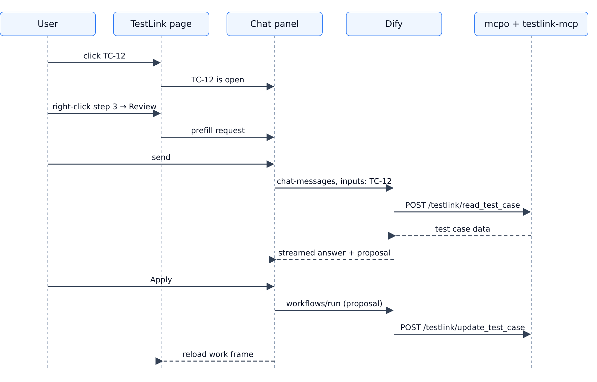
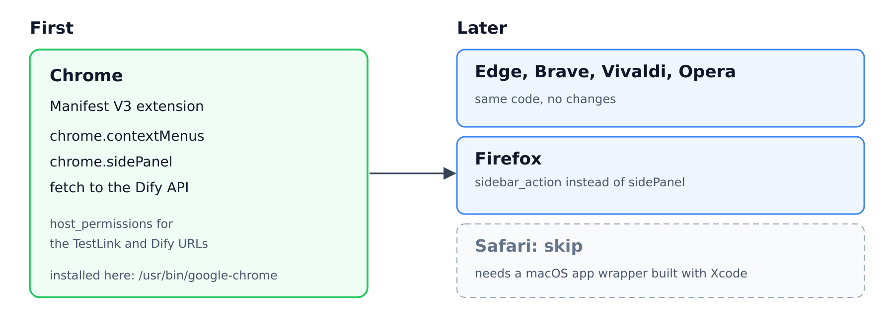
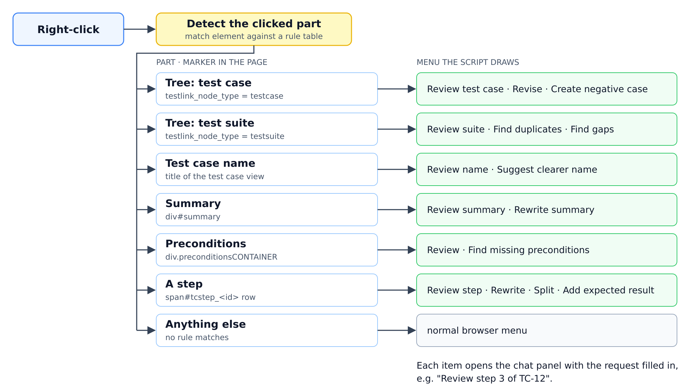

# Chat panel agent for TestLink

## Verdict: PASS

A Chrome extension adds a chat panel on the right of TestLink. You type a request, and an agent built in Dify answers in the panel. The agent sees the TestLink page on the left, and it reads and writes TestLink data through testlink-mcp, which mcpo serves as a REST API. TestLink and testlink-mcp stay unchanged.



## Finding: the agent works through two channels

| Channel | What it gives the agent | Used for |
|---|---|---|
| **The page on the left**, through the extension's helper script | What you are looking at: the open test case, your selection, your clicks | Understanding "this", "here" and "the one I clicked" |
| **testlink-mcp**, through mcpo | The real TestLink data: read, create, update and delete | Doing the work: review, revise, create |

When you type "review this", the page tells the agent that "this" is TC-12. The Dify agent reads TC-12 through mcpo and streams its answer into the panel. A write such as a revision comes back as a proposal. A separate Dify workflow writes it only after you click **Apply**, and then the work area reloads.



The panel is a normal web page, so it can:

- **take input**: a chat box, follow-up replies, and Apply and Discard buttons;
- **stream output**: each line appears as the agent writes it, with a Cancel button;
- **follow the page**: when you click another test case, the panel shows which one is selected.

Its one limit is width. A long side-by-side comparison opens in a new tab.

## Decided: right-click is a shortcut

The chat panel is the main way in. Right-click on a test case opens the panel with a request already filled in, such as "Review TC-12", so common requests take one click. Anything else is typed into the chat.

## Decided: a browser extension, Chrome first

The extension calls the Dify API over HTTP, so it needs no local program. It is preferred over a Tampermonkey script because only an extension gets a side panel.

Chrome comes first. It is installed here, and it has every API the design uses: `contextMenus`, `sidePanel`, and `fetch` with `host_permissions` for the TestLink and Dify URLs. Install it with Developer mode and "Load unpacked" at `chrome://extensions`.

Other browsers come later:

- **Edge, Brave, Vivaldi and Opera** run the same code.
- **Firefox** needs `sidebar_action` in place of `sidePanel`.
- **Safari** is out of scope, because it needs a macOS app wrapper built with Xcode.



## Decided: Dify as the backend

The agent is built in Dify, an open-source LLM app platform, so the backend needs no agent code. The review task is simple, so a light model is enough; Dify can use the local Ollama or a hosted model.

The panel talks to two Dify apps:

| App | Dify API | Tools | Role |
|---|---|---|---|
| **Review agent** (chat app) | `POST /v1/chat-messages` | Read-only: `read_test_case`, `list_test_cases_in_suite`, `get_requirement` | Answers, and returns any change as a proposal |
| **Apply** (workflow app) | `POST /v1/workflows/run` | `update_test_case` only | Runs only when you click Apply, with the proposal as input |

The review agent cannot write by mistake, because it lacks the write tool.

| Panel need | Dify feature |
|---|---|
| Streaming output | `response_mode: "streaming"` returns server-sent events: `message`, `agent_thought` for tool calls, and `message_end` |
| Follow-up chat | `conversation_id` from the first reply, sent with the next message |
| Page context | `inputs: {tcase_id, part, step}`, used as variables in the app's prompt |
| Access | The app's API key, sent as `Authorization: Bearer` |

| Risk | Mitigation |
|---|---|
| Dify runs about 10 containers and recommends at least 2 CPUs and 4 GB RAM | Run one shared Dify for the team |
| Small local models can be unreliable at calling tools | Test the review task with the chosen model first |
| The extension stores the Dify API key, and anyone with it can use the app | Run on a trusted network, like the TestLink stack itself |

## Decided: mcpo serves testlink-mcp to Dify

testlink-mcp speaks MCP over stdio only (`StdioServerTransport`, `src/index.ts:1549`). mcpo runs it as a child process and serves each tool as a REST endpoint, such as `POST /testlink/read_test_case`, with an OpenAPI schema at `/testlink/openapi.json`. Dify imports that schema as a custom tool. The `/testlink` prefix is the server name in mcpo's config file.

testlink-mcp is not on npm yet (testlink-mcp issue #129), so the image starts from the official mcpo image and copies in the built server from the published testlink-mcp image. testlink-mcp itself stays unchanged. The setup is in [mcpo/](mcpo/).

```dockerfile
FROM ghcr.io/open-webui/mcpo:main
COPY --from=dogkeeper886/testlink-mcp:1.6.0 /app /opt/testlink-mcp
COPY config.json /etc/mcpo/config.json
EXPOSE 8000
ENTRYPOINT ["sh", "-c", "exec mcpo --host 0.0.0.0 --port 8000 --api-key \"$MCPO_API_KEY\" --config /etc/mcpo/config.json"]
```

`config.json` starts `node /opt/testlink-mcp/dist/index.js`. mcpo passes its environment to the child, so `TESTLINK_URL` and `TESTLINK_API_KEY` go in `.env` with `MCPO_API_KEY`, and `docker compose up` runs it. `TESTLINK_URL` is the TestLink base URL; testlink-mcp adds `/lib/api/xmlrpc/v1/xmlrpc.php`. In Dify, import `http://<host>:8000/testlink/openapi.json` under **Tools → Custom**, and set `MCPO_API_KEY` as a Bearer key. Each Dify app then picks only the tools it needs.

The mcpo image is used as published because it pins `mcp` and `mcpo` versions that work together; `pip install mcpo` on its own pulled `mcp` 2.x, which mcpo 0.0.20 fails to import.

When testlink-mcp adds or changes tools, re-import the schema in Dify.

## Decided: a menu per item

The right-click menu changes with what you click. A script finds which part of the page was clicked, draws a menu for that part, and each item opens the chat panel with a precise request, such as "Review step 3 of TC-12".

TestLink's `tl-classic` templates already mark each part:

| Part | Marker in the page | Source |
|---|---|---|
| Test case or suite in the tree | `testlink_node_type` and the node ID | `gui/javascript/treebyloader.js` |
| Summary | `<div id="summary">` | `inc_tcbody.tpl:46` |
| Preconditions | `<div class="preconditionsCONTAINER">` | `inc_tcbody.tpl:61` |
| A step | `<span id="tcstep_<step id>">`, with actions and expected result in the next cells | `steps_horizontal.inc.tpl:81-93` |



The script draws its own menu. Chrome's built-in menu (`chrome.contextMenus`) is set up in advance, so it cannot change reliably from one click to the next.

| Risk | Mitigation |
|---|---|
| TestLink has two page designs, `tl-classic` and `dashio`, with different markup | Support `tl-classic` first |
| Our menu hides the browser's own menu, including "Copy" | Show our menu only on recognized parts; Shift + right-click opens the browser menu |
| The tree and the test case view are in separate frames | Run the script in all frames |
| A TestLink upgrade changes the markup | Keep the detection rules in one small table |

## Next

Choose which parts get a menu in the first version. A suggested start is a test case in the tree, the test case name, and a step.

---

Diagram sources are the `.svg` files in [diagrams/](diagrams/). To re-render them to PNG:

```bash
for f in diagrams/*.svg; do rsvg-convert -z 2 "$f" -o "${f%.svg}.png"; done
```
